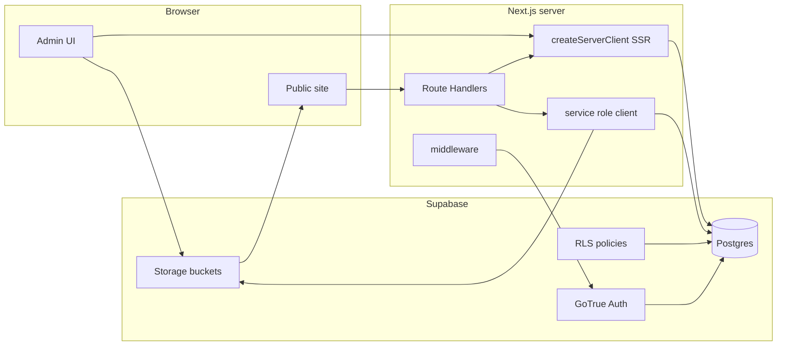

# Full Supabase backend migration

## Recommended execution order

1. **Supabase project + schema** — Postgres tables/enums/M2M match [prisma/schema.prisma](prisma/schema.prisma); add `public.profiles` (and optional trigger from `auth.users`).
2. **Auth + middleware + admin UI** — Replace NextAuth end-to-end so `/admin` and session cookies work before relying on new data APIs.
3. **Data layer** — Introduce `lib/supabase/`*; replace every `prisma` usage in API routes, [app/sitemap.ts](app/sitemap.ts), and seeding.
4. **RLS** — Turn on policies incrementally; avoid enabling broad RLS before public routes use the anon client correctly.
5. **Storage** — Buckets, upload UX, `remotePatterns` (depends on working admin auth).
6. **Cleanup** — Remove Prisma/NextAuth deps; point docs/Docker/CI at Supabase env vars and migrations.

## Current state

- **Data layer**: [lib/db.ts](lib/db.ts) wires **Prisma 7** to PostgreSQL via `pg` + `@prisma/adapter-pg` ([prisma/schema.prisma](prisma/schema.prisma): `User`, `Author`, `Tag`, `BlogPost`, `Package`, `Booking`, `Review`, `ContactSubmission`, `NewsletterSubscriber`, plus implicit many-to-many join tables for `BlogPost`↔`Tag` and `Package`↔`Tag`).
- **Auth**: [lib/auth.ts](lib/auth.ts) uses **NextAuth (credentials)** + `bcrypt` against `prisma.user`; [middleware.ts](middleware.ts) and [lib/adminAuth.ts](lib/adminAuth.ts) gate `/admin` and `/api/admin/`*.
- **Images**: [components/admin/ImageUploader.tsx](components/admin/ImageUploader.tsx) is **URL-only**; `featuredImage`, `images[]`, `avatar`, etc. store arbitrary HTTPS strings. The plan replaces this with **Supabase Storage** objects and stable public URLs (or path keys + a small resolver).

`ssl: false` in [lib/db.ts](lib/db.ts) is fine for local Docker Postgres; **Supabase requires TLS** on remote connections.

## Target architecture

- **Browser / cookie session**: `@supabase/ssr` `createBrowserClient` / `createServerClient` for admin login and session refresh.
- **Privileged writes** (admin CRUD): Route Handlers use a **server-only** Supabase client with the **service role** key *after* you verify the user session and `role` (never expose service role to the client).
- **Public reads** (packages, blog, reviews): Prefer **anon key** + **RLS** (e.g. allow `SELECT` on published blog rows, packages, reviews) so the database enforces access even if a route is misconfigured. Admin-only tables (`bookings` full detail, `contact_submissions`, etc.) get no public policies.
- **Media**: Admin uploads go to **Supabase Storage**; the site reads **public object URLs** (or signed URLs if you choose a private bucket—see Storage section).

## 1. Supabase project and schema

1. Create a Supabase project; collect **Project URL**, **anon key**, **service role key**.
2. **Materialize the same logical schema** on Supabase Postgres. Fastest path with minimal SQL hand-writing:
  - Point `DATABASE_URL` at Supabase’s **direct** connection string (port `5432`, SSL) and run `prisma migrate dev` / `prisma db push` (or `migrate deploy` in CI) so Prisma creates tables, enums, indexes, and M2M join tables matching [prisma/schema.prisma](prisma/schema.prisma).
  - **Important**: Use the **direct** URL for migrations; for high-concurrency serverless later, use the **pooler** URL in runtime with [Prisma + PgBouncer settings](https://www.prisma.io/docs/guides/database/supabase) if you briefly keep Prisma during transition—but the end goal here is **removing Prisma**, so pooler concerns shift to the Supabase JS client connection (HTTP) instead.
3. Add `**public.profiles`** (or extend via trigger): `id uuid references auth.users`, `role` text/check matching your `Role` enum, `name`, timestamps. This replaces the app-owned `users` table for **identity**; you can drop `public.users` after migration or keep it unused.
4. **Data migration** from existing DB: `pg_dump` / restore into Supabase, or re-seed with [prisma/seed.ts](prisma/seed.ts) adapted to Supabase (see Auth below).
5. **Verify implicit M2M table names** in the database after push (e.g. `_BlogPostToTag`, `_PackageToTag`) before writing PostgREST queries.

## 2. Auth: NextAuth → Supabase Auth

1. Remove **NextAuth** + **credentials + bcrypt** flow; add `@supabase/supabase-js` and `@supabase/ssr`.
2. Implement admin login: email/password (or magic link if you prefer) against Supabase Auth; store `**role`** in `profiles.role` (or `raw_user_meta_data` if you keep it minimal—table is easier to query and RLS).
3. **Middleware** ([middleware.ts](middleware.ts)): replace `getToken` with Supabase session helpers (`createServerClient` + `getUser()` or session cookie pattern from [Supabase Next.js SSR docs](https://supabase.com/docs/guides/auth/server-side/nextjs)). Protect `/admin` and `/api/admin/*` when no valid session.
4. **Existing `User` rows**: Supabase does not use your bcrypt hashes directly. Practical options: **invite** admins to set a password, one-time **password reset**, or create users via **Admin API** with a forced reset on first login. Plan this explicitly so nobody is locked out.
5. Update [app/api/auth/[...nextauth]/route.ts](app/api/auth/[...nextauth]/route.ts) → remove or replace with Supabase callback routes if using OAuth later.

### NextAuth / UI touchpoints (all must be updated)

- [app/admin/layout.tsx](app/admin/layout.tsx) — `SessionProvider` → Supabase-aware provider or drop if using client `createBrowserClient` only.
- [app/admin/login/page.tsx](app/admin/login/page.tsx) — `signIn('credentials')` → Supabase `signInWithPassword` (or magic link).
- [components/admin/AdminHeader.tsx](components/admin/AdminHeader.tsx) — `useSession` / `signOut` → Supabase user + `signOut`.
- [app/admin/page.tsx](app/admin/page.tsx) — `useSession` → Supabase session/user.
- [types/next-auth.d.ts](types/next-auth.d.ts) — remove or replace with your session types.
- **Admin API routes** that call `auth()` today (packages, blog, tags, reviews, bookings, authors, stats): either keep a **server-side `getUser()`** in each handler for defense-in-depth, or rely on middleware only and use service role after that—**document the chosen pattern** and apply consistently.

## 3. Supabase Storage (replace URL-only images)

**Goal**: Stop relying on pasted external URLs in admin; store files in Supabase and persist **stable references** in Postgres (`featuredImage`, `images[]`, `avatar`, reviewer avatars if desired).

### Buckets and layout

- Prefer **one bucket** (e.g. `media`) with **folder prefixes** (`packages/`, `blog/`, `authors/`, `reviews/`) *or* separate buckets per concern—single bucket is simpler to policy and backup.
- **Public read for marketing assets** (recommended): bucket is **public**; `SELECT` on `storage.objects` for `anon` on that bucket, so `getPublicUrl()` works for [next/image](https://nextjs.org/docs/app/api-reference/components/image#remotepatterns) without signing every request.
- **Upload policies**: allow `INSERT`/`UPDATE`/`DELETE` only for **authenticated** users who are admins. Implement via Storage RLS policies on `storage.objects` (e.g. check `auth.uid()` and join to `profiles.role`), or use a **server Route Handler** that verifies the session then uploads with the **service role** client (simpler policies, all writes server-side).

### Upload UX ([components/admin/ImageUploader.tsx](components/admin/ImageUploader.tsx))

- Replace URL-only flow with: file `<input type="file" accept="image/*">`, optional client-side size/type checks, then:
  - **Option A (client upload)**: authenticated `createBrowserClient` → `storage.from('media').upload(path, file, { upsert: true })` → persist returned **public URL** or `**bucket/path`** in form state.
  - **Option B (server upload)**: `FormData` to e.g. `POST /api/admin/upload` → verify Supabase session + role → upload with service role → return public URL JSON.
- Generate **unique object paths** to avoid collisions: e.g. `${prefix}/${Date.now()}-${randomId}.${ext}` or include entity id after first save.
- **What to store in the database**:
  - **Public URL string** (simplest for existing UI): `getPublicUrl` result; or
  - **Storage path only** + small helper `getMediaUrl(path)` that builds the public URL (easier if the project URL ever changes).

### Next.js images

- Add your Supabase host to [next.config.ts](next.config.ts) `images.remotePatterns` (e.g. `**.supabase.co` / your custom domain if used) so `next/image` can optimize Storage URLs.

### Existing data

- **Keep old rows** that already point to third-party URLs—they still render.
- **Optional backfill script**: download and re-upload seed assets to Storage, then update rows (only needed if you want everything unified).

### Security checklist

- Never expose **service role** to the browser.
- Validate **MIME type and max size** on upload (client + server).
- If any bucket must stay **private**, use **signed URLs** in API responses for those fields and skip `next/image` remote optimization or use a short-lived signed URL pattern you document.

## 4. Replace Prisma with Supabase client in Route Handlers

For each file that imports [lib/db.ts](lib/db.ts), replace `prisma.*` with `supabase.from('...')` calls:

| Area                   | Tables / notes                                                                                                                           |
| ---------------------- | ---------------------------------------------------------------------------------------------------------------------------------------- |
| Packages               | `packages`, tag links via join table                                                                                                     |
| Blog                   | `blog_posts`, `authors`, M2M join table (**verify name in DB**)                                                                          |
| Bookings               | `bookings` — public create in [app/api/bookings/route.ts](app/api/bookings/route.ts) vs admin list/update                                |
| Reviews, tags, contact | respective tables                                                                                                                        |
| Stats                  | `count` queries via `.select('*', { count: 'exact', head: true })`                                                                       |
| Blog views             | [app/api/blog/[slug]/route.ts](app/api/blog/[slug]/route.ts) — `update` on `views`; align with RLS (often service role or narrow policy) |

**Multi-step writes** (blog post + tags, package + tags): use a **Postgres RPC** if you need atomicity; otherwise document ordering and failure behavior.

Implementation details to plan for:

- **Relations**: Supabase/PostgREST uses `select('*, author(*), tags(*)')` style embeds; M2M may need explicit `.from('join_table')` or views.
- **JSON columns** (`itinerary`, `faq`, `travelers`): map to `Json` columns as today.
- **Enums**: Postgres enums created by Prisma remain valid; generated TypeScript types from Supabase CLI will reflect them.
- **Transactions**: use RPC (`supabase.rpc`) or multiple ordered calls where you today rely on Prisma transactions.

Add `**lib/supabase/server.ts`** (cookie client) and `**lib/supabase/admin.ts`** (service role, `server-only`) to centralize construction and env validation (`NEXT_PUBLIC_SUPABASE_URL`, keys).

## 5. Row Level Security (RLS)

Enable RLS on all public tables. Typical policy sketch:

- `**packages`, `reviews`**: `SELECT` for `anon` (and `authenticated` if needed); no insert/update/delete for anon.
- `**blog_posts**`: `SELECT` where `published_at is not null` (and any other “published” rule you use); admin writes only via service role or policies checking `profiles.role`.
- `**bookings**`: `INSERT` for anon/authenticated for the public booking flow if desired; `SELECT`/`UPDATE` only for admins (service role or role-checked policy).
- `**contact_submissions`, `newsletter_subscribers**`: insert for public where applicable; read/update only admin.

Iterate until public API routes work with **anon** client and admin routes use **service role** only after session + role check.

**Storage**: mirror the same idea—public read for the public bucket (if used), writes restricted to authenticated admins (Storage policies or server-only service role).

## 6. Cleanup and tooling

- Remove dependencies: `prisma`, `@prisma/client`, `@prisma/adapter-pg`, `pg` (if unused), `next-auth`, `bcryptjs` (if unused).
- Remove [prisma.config.ts](prisma.config.ts), schema, and migrate future DB changes to **Supabase migrations** (SQL in `supabase/migrations`) once Prisma is retired—or keep one-time Prisma only until cutover.
- `**npm` scripts**: replace `db:`* Prisma scripts with `supabase` CLI commands where useful.
- **Env docs**: document required vars in your deployment platform (Vercel, Docker, etc.); ensure **service role** is never prefixed with `NEXT_PUBLIC_`.
- **Local dev / Docker**: decide whether developers use Supabase only, or keep optional local Postgres; update [docker-compose.yml](docker-compose.yml), [Makefile](Makefile), [Dockerfile](Dockerfile) if they still assume Prisma + local DB.

## 7. Optional follow-up

- **Newsletter**: [app/api/subscribe/route.ts](app/api/subscribe/route.ts) does not persist today; wire it to `newsletter_subscribers` with RLS (insert-only for anon).

## Risk / testing checklist

- Admin login, session refresh, and protected middleware behavior.
- Public package/blog/review reads with anon + RLS (**RLS too loose on `bookings` / `contact_submissions` is a high-severity risk**—start deny-by-default).
- Booking creation and admin booking updates.
- M2M tag updates on blog posts and packages (most error-prone area).
- Sitemap generation still sees published packages/posts.
- Blog slug route: view counter still works under RLS.
- **Storage**: upload from admin, public pages render `next/image` correctly, old external URLs still work; delete/replace object behavior if you implement removal on edit.

